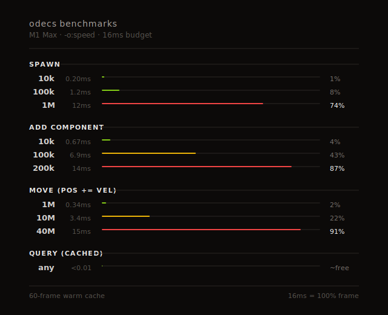

# 🏺 odecs 🏺

A minimal, data-oriented, high-performance Entity Component System written in [Odin](https://odin-lang.org/). Architecture directly inspired by [Flecs](https://github.com/SanderMertens/flecs) (C). Shares the same minimal design philosophy and near-identical API as sibling library [bitECS](https://github.com/NateTheGreatt/bitecs) (TypeScript).

Can almost be pronounced like Odysseus.

## Features

|                     |                     |
|----------------------------|----------------------------|
| 🔮 Simple, declarative API | 🔍 Powerful querying       |
| 🧩 Archetypes              | 🔗 Relationships           |
| 👀 Observers               | 🏛️ Hierarchies             |

### Roadmap

- [ ] onSet observer
- [ ] Prefabs
- [ ] Hierarchical Queries

## Quick Start

```odin
import ecs "odecs/src"

Position :: struct { x, y: f32 }
Velocity :: struct { vx, vy: f32 }

main :: proc() {
    using ecs

    world := create_world()
    defer delete_world(world)

    player := add_entity(world, Position{0, 0}, Velocity{1, 1})

    q := query(world, {all(Position, Velocity)})
    for arch in archs(&q) {
        positions := get_table(world, arch, Position)
        velocities := get_table(world, arch, Velocity)

        for i in 0..<len(positions) {
            positions[i].x += velocities[i].vx
            positions[i].y += velocities[i].vy
        }
    }
}
```

## Queries

| Require | Boolean | Set Theory |
|---------|---------|------------|
| ALL of  | `and`   | `all`      |
| SOME of | `or`    | `some`     |
| NONE of | `not`   | `none`     |

```odin
using ecs

query(world, {all(Position, Velocity)})
query(world, {or(Player, Enemy)})
query(world, {not(Dead, Disabled)})
query(world, {all(Position), not(Dead)})
query(world, {all(Position, or(Player, Enemy), none(Dead))})
```

## Relationships

```odin
using ecs

ChildOf :: struct {}
add_component(world, ChildOf, Exclusive)  // only one parent allowed
add_component(world, ChildOf, Cascade)    // delete children when parent deleted

parent := add_entity(world)
child := add_entity(world, pair(ChildOf, parent))  // inline with entity creation

// alternative ways to add pairs
add_component(world, child, pair(ChildOf, parent))
add_pair(world, child, ChildOf, parent)

// Exclusive: adding new parent auto-removes old one
new_parent := add_entity(world)
add_pair(world, child, ChildOf, new_parent)  // (ChildOf, parent) removed

// Cascade: deleting parent deletes children
remove_entity(world, new_parent)  // child also deleted

// pairs can carry data - reads like: "chest Contains 50 gold"
Contains :: struct { amount: int }
gold := add_entity(world)
chest := add_entity(world)
add_pair(world, chest, Contains{50}, gold)

query(world, {pair(ChildOf, Wildcard)})  // all children
query(world, {pair(Contains, gold)})     // everything containing gold
```

## Observers

```odin
using ecs

Dead :: distinct struct {}

on_death :: proc(world: ^World, entity: EntityID) {
    fmt.println("Entity died:", entity)
}

obs := observe(world, on_add(all(Dead)), on_death)
defer unobserve(world, obs)

add_component(world, player, Dead{})  // triggers observer
```

## Benchmarks



## API

```odin
// World
create_world :: proc(allocator := context.allocator) -> ^World
delete_world :: proc(world: ^World)

// Entities
add_entity :: proc(world: ^World, components: ..any) -> EntityID
remove_entity :: proc(world: ^World, entity: EntityID)
entity_alive :: proc(world: ^World, entity: EntityID) -> bool

// Components
add_component :: proc(world: ^World, entity: EntityID, component: $T)
add_component :: proc(world: ^World, $Type: typeid, component: $T)  // attach to type
add_component :: proc(world: ^World, $Type: typeid, $Tag: typeid)   // attach tag to type
add_components :: proc(world: ^World, entity: EntityID, components: ..any)
remove_component :: proc(world: ^World, entity: EntityID, $T: typeid)
get_component :: proc(world: ^World, entity: EntityID, $T: typeid) -> ^T
has_component :: proc(world: ^World, entity: EntityID, $T: typeid) -> bool

// Relation Traits (attach to relation types)
Exclusive :: struct {}  // entity can have only one target per relation
Cascade :: struct {}    // delete entity when its target is deleted

// Queries - use query() + archs() pattern
query :: proc(world: ^World, terms: []Term_Arg) -> Query
archs :: proc(q: ^Query) -> (arch: ^Archetype, ok: bool)  // iterator
get_table :: proc(world: ^World, arch: ^Archetype, $T: typeid) -> []T
get_entities :: proc(arch: ^Archetype) -> []EntityID

// Terms
and, all   :: proc(..typeid | ..Term) -> Term  // require ALL
or, some   :: proc(..typeid | ..Term) -> Term  // require SOME
not, none  :: proc(..typeid | ..Term) -> Term  // require NONE
pair       :: proc(Relation, Target) -> Term

// Pairs - "entity Relation target"
add_pair :: proc(world: ^World, entity: EntityID, $R: typeid, target: EntityID)  // tag
add_pair :: proc(world: ^World, entity: EntityID, data: $R, target: EntityID)    // data
has_pair :: proc(world: ^World, entity: EntityID, $R, $T: typeid) -> bool
get_pair :: proc(world: ^World, entity: EntityID, $R, $T: typeid) -> ^R

// Observers
observe :: proc(world: ^World, def: Observer_Def, callback: proc(^World, EntityID)) -> ObserverID
unobserve :: proc(world: ^World, id: ObserverID)
on_add, on_remove :: proc(terms: ..Term) -> Observer_Def
```

## License

MIT
